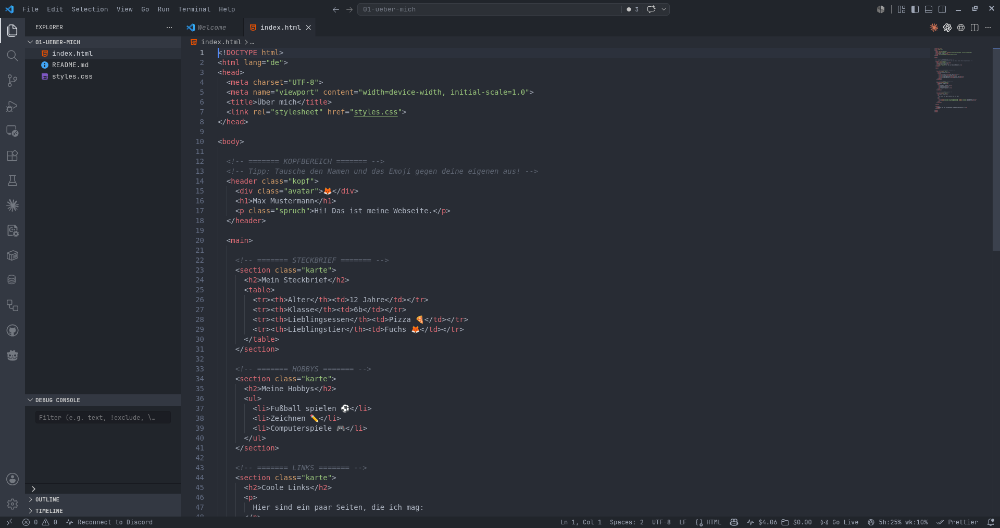
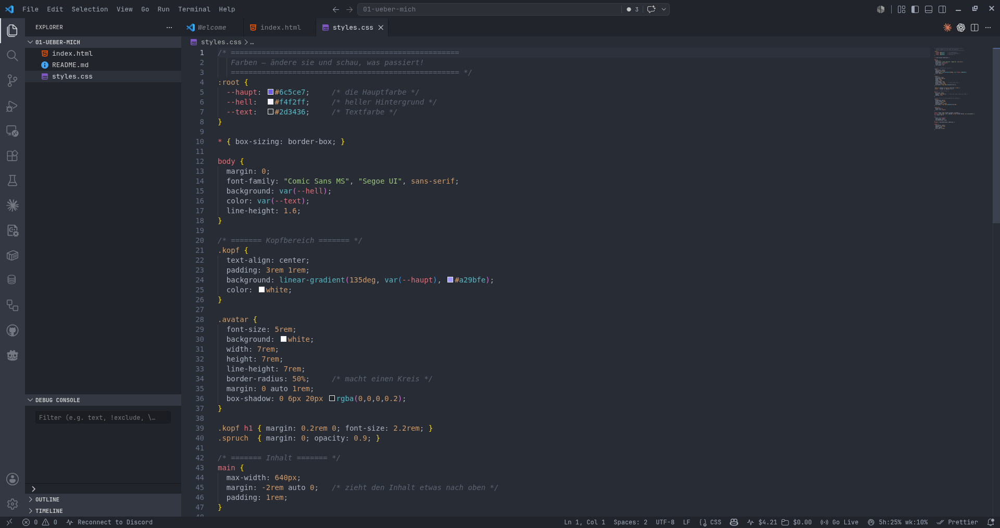
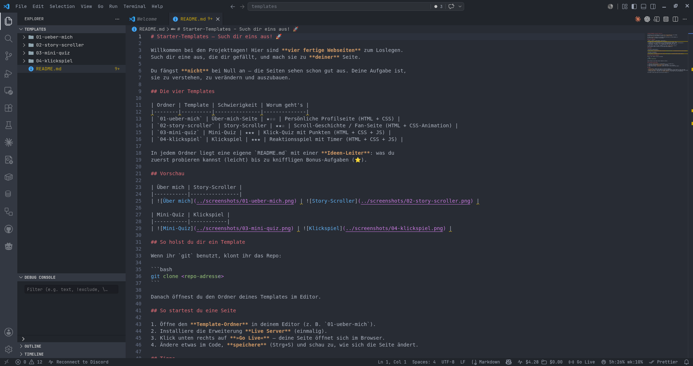

# Anleitung: VS Code & dein erstes Template 💻

Diese Anleitung erklärt dir **Schritt für Schritt**, wie du mit dem Programm
**VS Code** arbeitest und dein Template zum Leben erweckst. Keine Sorge – das ist
einfacher, als es aussieht!

---

## Was ist VS Code?

**VS Code** (voller Name: Visual Studio Code) ist ein Programm zum Schreiben von
Code. Stell es dir wie ein super-schlaues Schreibprogramm für Webseiten vor. Hier
tippst du dein HTML, CSS und JavaScript.

---

## Template öffnen

Such dir im Ordner `templates` ein Template aus (siehe `templates/README.md`).
Öffne dann in VS Code im Menü **»File« → »Open Folder…«** und wähle den
Template-Ordner aus (z. B. `01-ueber-mich`):

Danach sieht das Ganze so aus:

Lass uns die wichtigsten Bereiche anschauen:

### 1. Der Explorer (links)

Ganz links ist der **Explorer**. Hier siehst du alle **Dateien** deines Templates:

- `index.html` – der **Inhalt** deiner Seite
- `styles.css` – das **Aussehen** (Farben, Schrift)
- `README.md` – die **Anleitung** mit Ideen, was du tun kannst
- (bei manchen Templates) `script.js` – die **Action** mit JavaScript

Klick eine Datei an, um sie zu öffnen. So sieht der Explorer aus der Nähe aus:

### 2. Der Editor (Mitte)

In der **Mitte** ist der große Bereich, in dem du den Code siehst und änderst. Oben
gibt es **Tabs** – pro geöffneter Datei einer, genau wie im Browser.

### 3. Die Statusleiste (unten)

Ganz **unten** ist eine schmale Leiste mit Infos. Hier erscheint später der wichtige
Knopf **»Go Live«**.

---

## Die Dateien verstehen

### `index.html` – der Inhalt

Hier steht, **was** auf der Seite ist: Überschriften, Texte, Bilder, Listen. Schau
nach den **Tags** in spitzen Klammern wie `<h1>` oder `
`.

### `styles.css` – das Aussehen

Hier steht, **wie** die Seite aussieht: Farben, Schriftgrößen, Abstände. Tipp: Neben
einem Farbcode siehst du ein **kleines Farbquadrat**. Klick drauf und wähle eine neue
Farbe mit der Maus!

---

## Deine Seite im Browser anschauen (Live Server)

Damit du deine Seite sehen kannst, brauchst du die Erweiterung **Live Server**.

### Einmalig installieren

Klick links auf das **Extensions**-Symbol, suche nach **»Live Server«** und klick auf
**Install**.

### Starten mit »Go Live«

Danach erscheint unten rechts in der Statusleiste **»Go Live«**. Klick darauf – deine
Seite öffnet sich im Browser.

> **Tipp:** Stell VS Code und den Browser **nebeneinander**. Wenn du etwas im Code
> änderst und **speicherst** (Strg+S), aktualisiert sich der Browser von allein. So
> siehst du sofort, was passiert! Falls nicht: F5 im Browser drücken.

---

## So arbeitest du (der Kreislauf)

1. **Datei öffnen** im Explorer (z. B. `index.html`).
2. **Etwas ändern** (z. B. einen Text).
3. **Speichern** mit `Strg`+`S`.
4. **Im Browser schauen**, was sich geändert hat.
5. Wieder von vorne. 🔁

Das ist das ganze Geheimnis. Kleine Änderung → speichern → schauen.

> **Achtung – speichern nicht vergessen!** Solange eine Datei nicht gespeichert ist,
> siehst du im Tab statt des `×` einen **weißen Punkt**:
>
> 
>
> Nach `Strg`+`S` verschwindet der Punkt – erst dann sieht der Browser deine Änderung.

---

## Bonus: Eine eigene Datei anlegen ⭐

Meistens änderst du nur die vorhandenen Dateien. Manchmal willst du aber eine **neue**
anlegen – z. B. eine zweite Seite `seite2.html`. So geht's:

**1. Neue Datei erstellen.** Klick im Explorer auf »New File« (oder Menü »File« →
»New File«) und bestätige den Dateityp mit `Enter`:

**2. Speichern und benennen.** Drück `Strg`+`S` und gib einen Namen mit Endung ein,
z. B. `seite2.html`:

**3. Ordner bestätigen (falls nötig).** Wenn du einen Namen mit einem neuen Ordner
eingibst, fragt VS Code, ob der Ordner erstellt werden soll – bestätige mit `Enter`:

> **Tipp:** Die **Endung** ist wichtig! `.html` für Seiten, `.css` fürs Aussehen,
> `.js` für JavaScript. Verlinke neue Seiten mit `<a href="seite2.html">…</a>`.

---

## Welches Template hast du? Hier die Übersicht

Im Ordner `templates` liegen alle vier Vorlagen nebeneinander:

Jedes Template hat eine eigene `README.md` mit einer **Ideen-Leiter**: von leichten
Änderungen (★) bis zu kniffligen Bonus-Aufgaben (⭐).

---

## Wenn etwas nicht klappt 🛠️

- **Nichts ändert sich?** Hast du **gespeichert** (Strg+S)? Der weiße Punkt im Tab
  zeigt: noch nicht gespeichert.
- **Browser zeigt nichts Neues?** Drück **F5** im Browser.
- **Du bist stecken geblieben?** Frag die **KI** oder den Betreuer – z. B. »Wie mache
  ich die Überschrift größer?«. Fehler sind völlig normal!

Viel Spaß beim Bauen! 🚀
