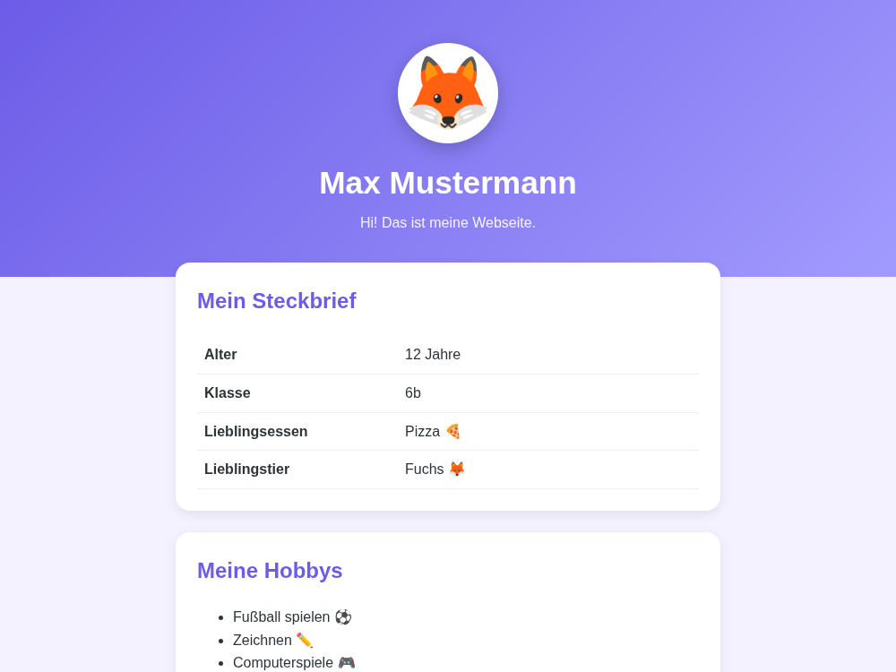
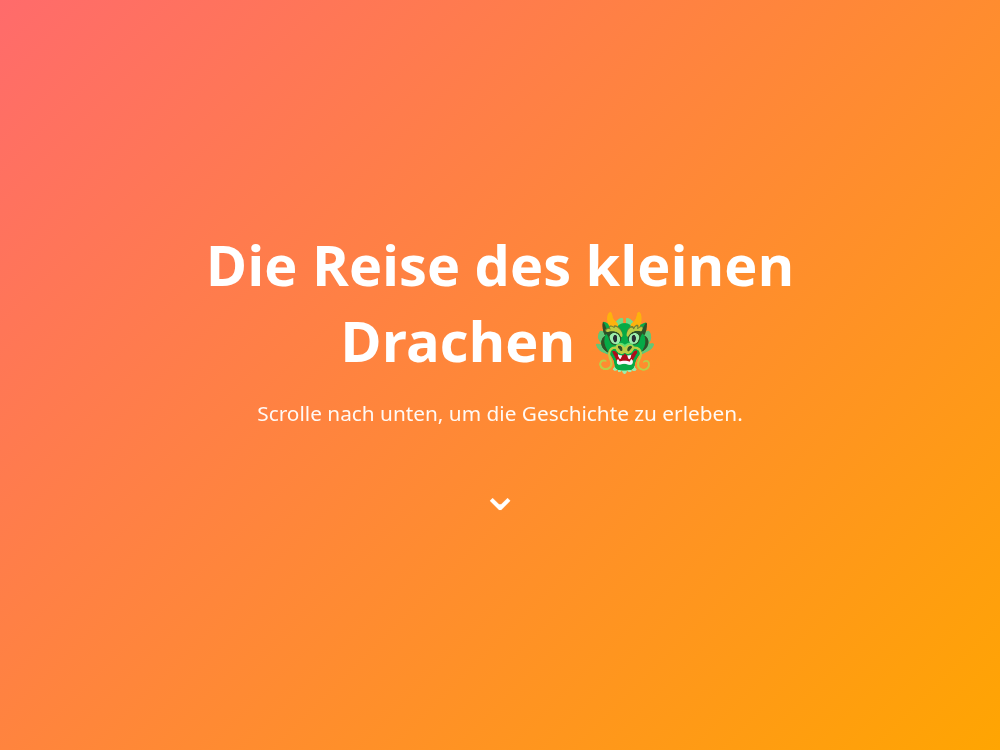
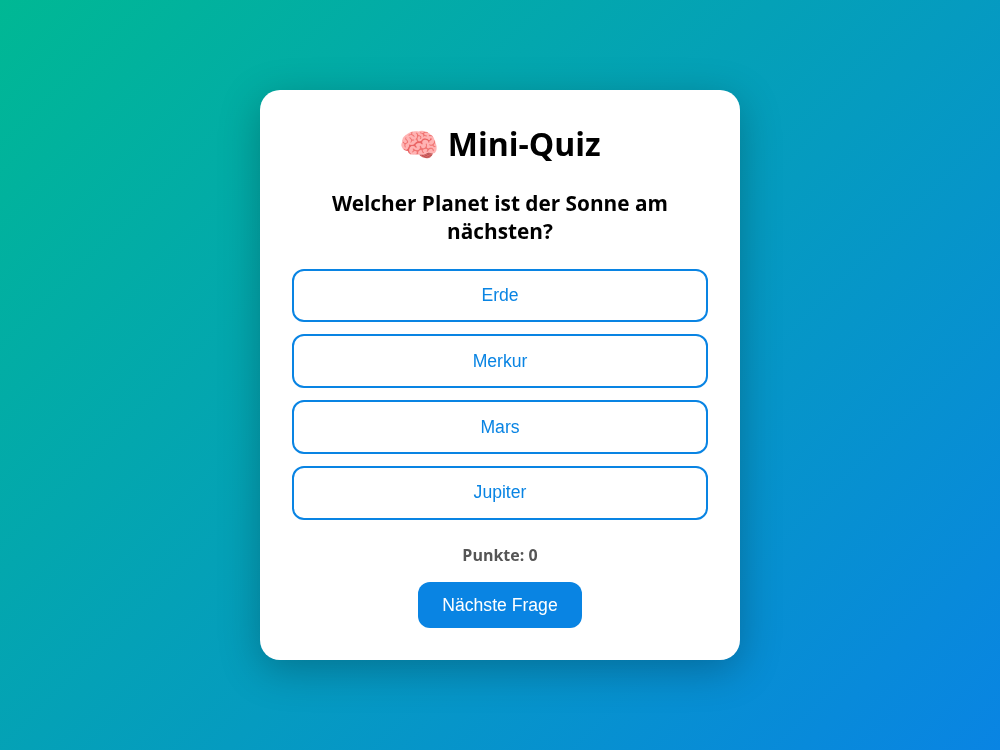
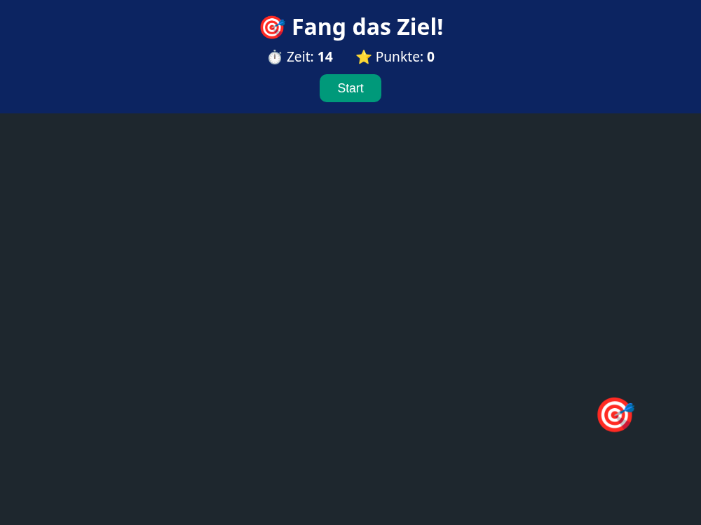

# Starter-Templates – Such dir eins aus! 🚀

Willkommen bei den Projekttagen! Hier sind **vier fertige Webseiten** zum Loslegen.
Such dir eine aus, die dir gefällt, und mach sie zu **deiner** Seite.

Du fängst **nicht** bei Null an – die Seiten sehen schon gut aus. Deine Aufgabe ist,
sie zu verstehen, zu verändern und auszubauen.

## Die vier Templates

| Ordner | Template | Schwierigkeit | Worum geht's |
|--------|----------|---------------|--------------|
| `01-ueber-mich` | Über-mich-Seite | ★☆☆ | Persönliche Profilseite (HTML + CSS) |
| `02-story-scroller` | Story-Scroller | ★★☆ | Scroll-Geschichte / Fan-Seite (HTML + CSS-Animation) |
| `03-mini-quiz` | Mini-Quiz | ★★★ | Klick-Quiz mit Punkten (HTML + CSS + JS) |
| `04-klickspiel` | Klickspiel | ★★★ | Reaktionsspiel mit Timer (HTML + CSS + JS) |

In jedem Ordner liegt eine eigene `README.md` mit einer **Ideen-Leiter**: was du
zuerst probieren kannst (leicht) bis zu kniffligen Bonus-Aufgaben (⭐).

## Vorschau

| Über mich | Story-Scroller |
|-----------|----------------|
|  |  |

| Mini-Quiz | Klickspiel |
|-----------|------------|
|  |  |

## So holst du dir ein Template

Wenn ihr `git` benutzt, klont ihr das Repo:

```bash
git clone <repo-adresse>
```

Danach öffnest du den Ordner deines Templates im Editor.

## So startest du eine Seite

> Neu bei VS Code? Lies zuerst die **[Anleitung](../ANLEITUNG.md)** – dort ist alles
> mit Screenshots erklärt.

1. Öffne den **Template-Ordner** in deinem Editor (z. B. `01-ueber-mich`).
2. Installiere die Erweiterung **Live Server** (einmalig).
3. Klick unten rechts auf **»Go Live«** – deine Seite öffnet sich im Browser.
4. Ändere etwas im Code, **speichere** (Strg+S) und schau zu, wie sich die Seite ändert.

## Tipps

- **Tippe selbst**, kopiere nicht alles – so lernst du schneller.
- **Zu zweit** macht es oft mehr Spaß und ihr helft euch gegenseitig. Allein arbeiten ist aber auch okay.
- **Fehler sind normal.** Wenn etwas nicht klappt: speichern, Seite neu laden (F5), und ruhig die KI oder den Betreuer fragen.
- Im Hauptordner gibt es `course.md` als **Nachschlagewerk** für alle HTML-, CSS- und JS-Bausteine.

Viel Spaß – am Ende zeigt jeder seine Seite den anderen! 🎉
